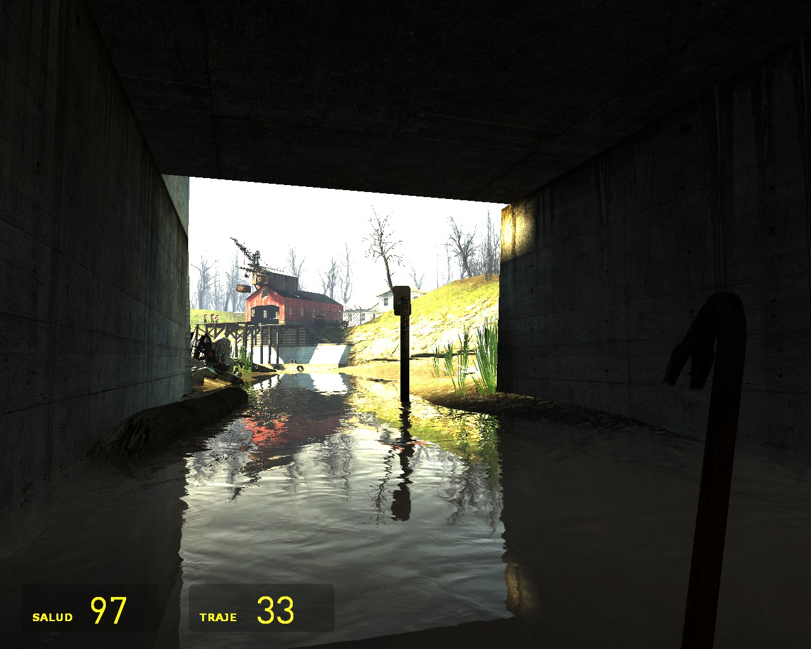
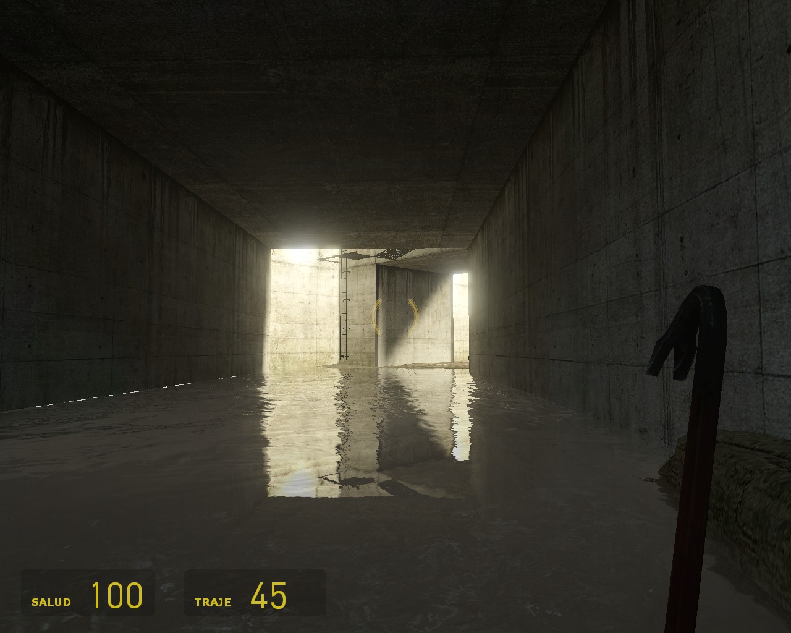
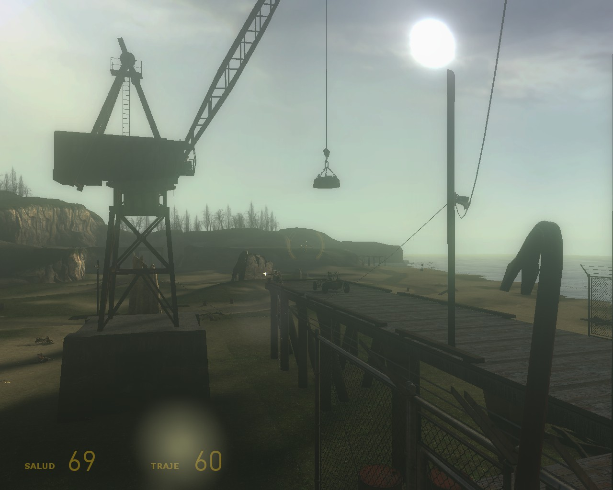
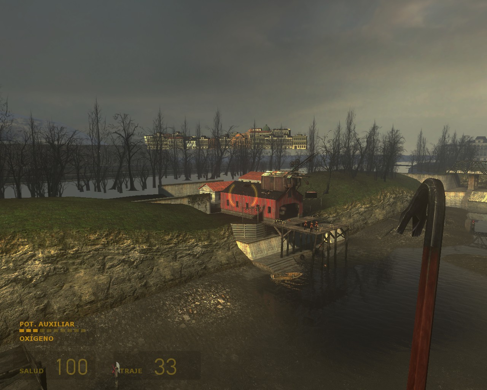

# Half Life Reshade Mod

Un simple preset de reshade para HL2

## Descripción

Este preset de reshade pretende dar un lavado de cara al clásico juego de valve Half Life 2 implementendo nuevas funcions que trae, no pretendo en primer lugar algo realista o estilizado si no algo más vanilla al original.

>Changelog
```
    BETA
    v0.1: Creación y publicación, futuros bugs y errores serán corregidos
```
## Screenshots
> Beta V0.1






## Instalación

Primero que nada hay que tener [Reshade](https://reshade.me) y todas sus librerías(se descargan automáticamente cuando se instala el programa), la instalación es tan sencilla como abrir el instalar y localizar el juego por defecto ```C:\Program Files (x86)\Steam\steamapps\common\Half-Life 2``` luego de instalar ir ala carpeta bin y pegar los archivos del repositorio. Al iniciar el juego tendría que cargar de manera automática el preset. Y a disfrutar!

## Contacto y dudas

> DC: Chara420#7845